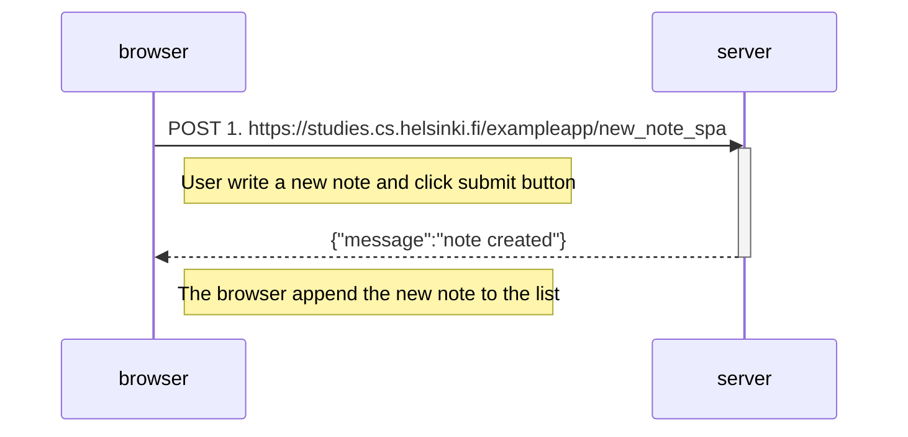

```mermaid

sequenceDiagram  

participant browser

participant server

browser->>server: POST 1.  https://studies.cs.helsinki.fi/exampleapp/new_note_spa

activate server

Note right of browser: User write a new note and click submit button


server-->>browser: {"message":"note created"}
  
deactivate server

Note right of browser: The browser append the new note to the list
```